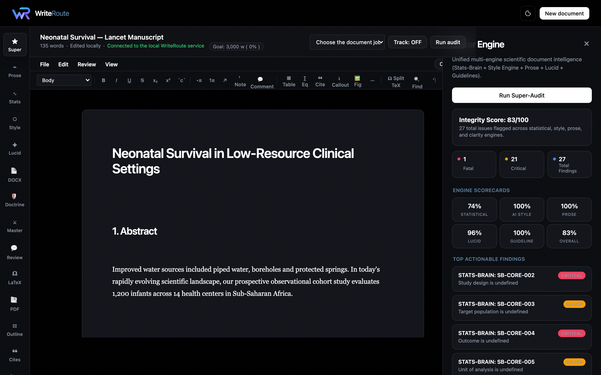
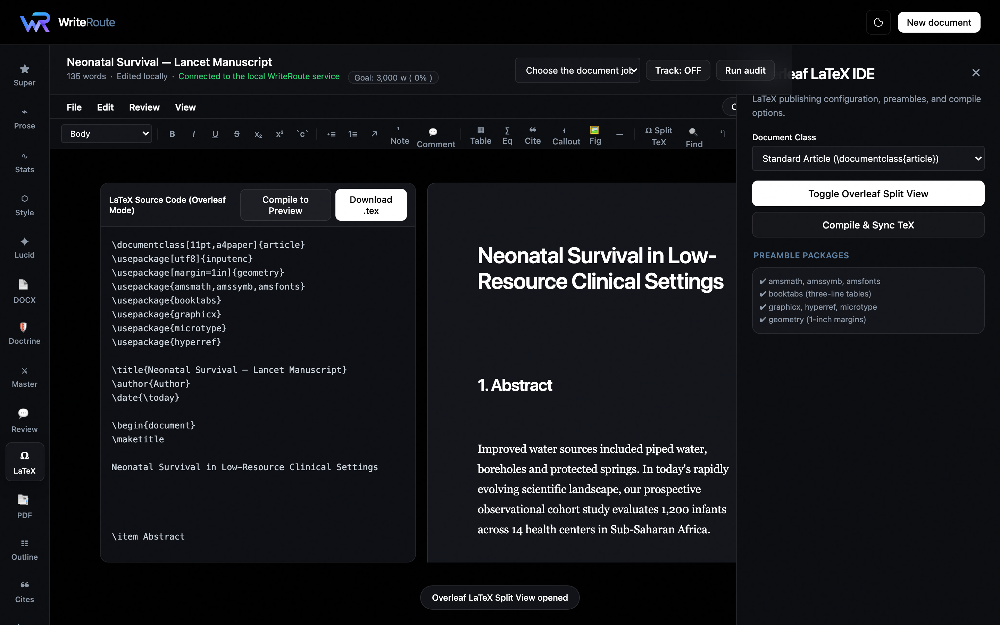
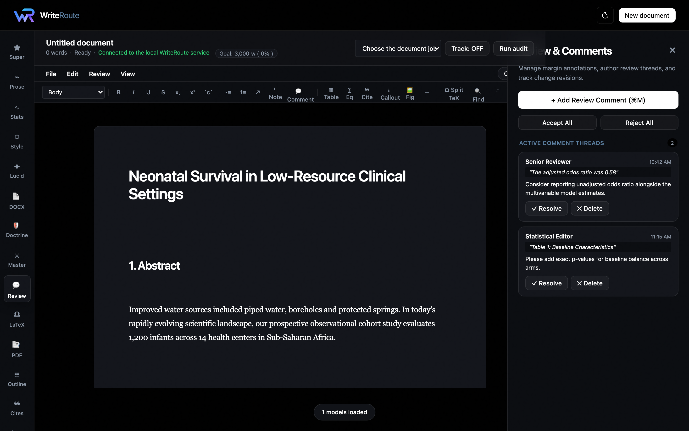
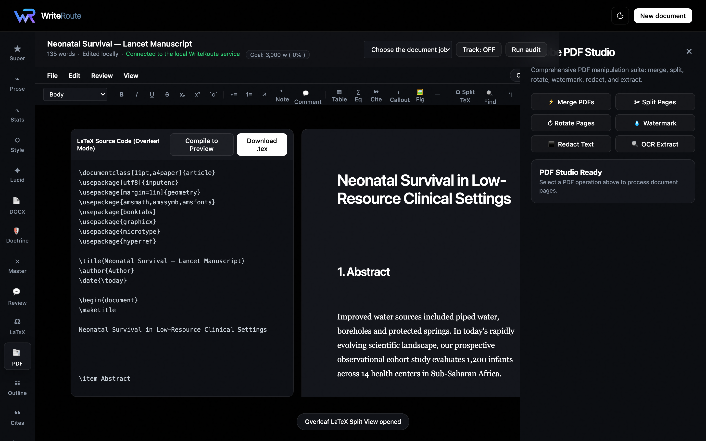
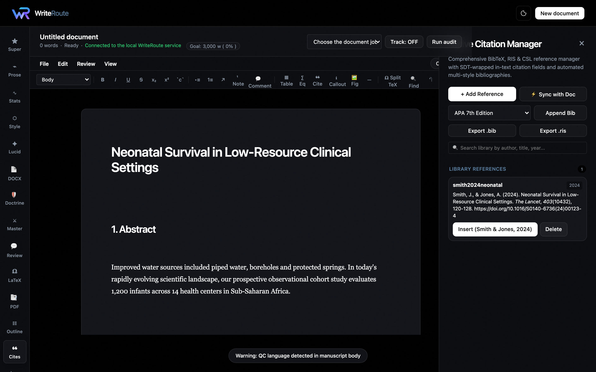
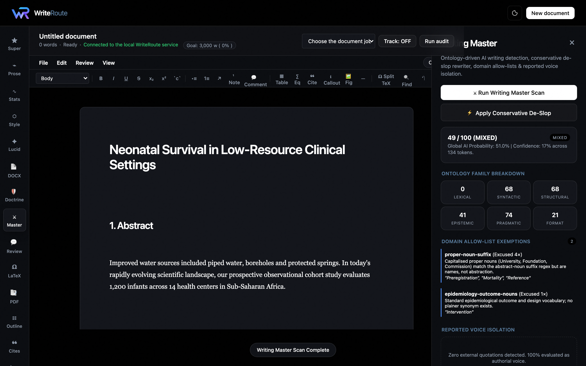
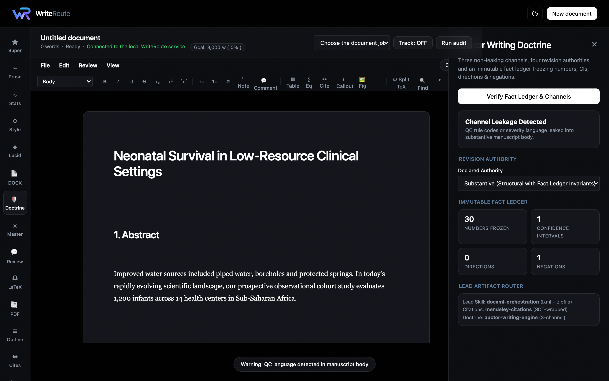

# WriteRoute Studio — Scientific Manuscript Authoring & Publishing Super Engine

> **Tool #4 in the Autonomous Research & Synthesis Suite**
>
> 1. 🦐 **[Resource Shrimp](https://github.com/Reyanda/resource-shrimp)** — Research asset acquisition, multi-source ingestion & AI synthesis
> 2. 🛡️ **[Medantir Evidence](https://github.com/Reyanda/medantir-evidence)** — Autonomous systematic reviews, RoB 2 / ROBINS-I, GRADE & causal inference
> 3. 🎨 **[Open Canvas Studio](https://github.com/Reyanda/open-canvas-studio)** — High-fidelity scientific figure, vector diagram & visual asset design
> 4. ✍️ **[WriteRoute Studio](https://github.com/Reyanda/writeroute-studio)** — Unified manuscript workbench: Word review suite, Overleaf LaTeX IDE, Adobe PDF studio, DocXML orchestration, Mendeley citation engine & Auctor Writing Doctrine

---

## 🌟 The Unified Manuscript Workbench

WriteRoute Studio unifies the complete document authoring and editorial engineering toolchain into a single, high-performance web interface following the **Air Style Reference** design system (dark atmospheric canvas, sculptural glass cards, whiteout typography).



---

## 🚀 Key Capabilities

### 1. ⚡ The 5-in-1 Super Engine (`writeroute.super_engine`)
Unified multi-engine audit scorecard, statistical risk radar, and automated invariant-preserving repair:
- **WriteRoute Core**: Names editorial defects, proposes minimal surgical edits, and refuses meaning mutations.
- **STATS-BRAIN**: Estimand-first causal and statistical verification, target trial emulation, and complex survey (DHS/MICS) auditing.
- **Scientific Pattern Engine v2**: Deterministic 54-rule ontology for LLM style burdens, stacked hedging, and uncalibrated claims.
- **LUCID-SCI**: Precision-preserving scientific clarity and anti-slop phrasebook linting.
- **Auctor Writing Engine**: Reporting guidelines (CONSORT, PRISMA, STROBE) and section contracts.

### 2. 𝛀 Overleaf LaTeX Split-Screen IDE (`writeroute.latex_export`)
- Real-time side-by-side split-view LaTeX code editor with live syntax highlighting and line numbers.
- Academic Document Class selector: `article`, `IEEEtran`, `acmart`, `nature`, `revtex4-2`, and `report`.
- Instant 1-click `.tex` export bundle with scientific preambles (`amsmath`, `booktabs`, `graphicx`, `microtype`, `hyperref`).



### 3. 📘 Microsoft Word Authoring & Review Suite
- **💬 Review Comments Thread (`⌘M`)**: Attach margin review annotations with author badges, timestamps, and referenced quotes.
- **⚡ Track Changes Engine**: Real-time insertion/deletion markup with 1-click "Accept All" / "Reject All" bulk change controls.
- **¹ Dynamic Footnotes & Endnotes**: In-text numbered superscripts linked to a dynamic bottom-of-page container.
- **📐 Page Layout & Geometry**: Switch between A4, US Letter, and US Legal paper sizes with portrait/landscape orientations and normal/narrow/wide margins.
- **🎯 Submission Word Goal Tracker**: Configure target word counts (e.g. 3,000 words for Lancet/Nature) with real-time percentage progress.



### 4. 📑 Adobe PDF Manipulation Suite (`writeroute.pdf_tools`)
High-performance PyMuPDF stream processing tools:
- **⚡ Merge PDFs**: Combine multiple manuscript files and supplements.
- **✂ Split & Extract Pages**: Extract custom page ranges (`e.g. 1-3, 5, 8-12`).
- **↻ Rotate Pages**: 90°, 180°, or 270° orientation adjustments.
- **💧 Custom Watermark**: Overlay customizable diagonal watermarks with adjustable angle and opacity.
- **⬛ HIPAA Redaction**: Permanently black out patient identifiers and sensitive terms directly in the PDF stream.
- **🔍 Semantic OCR Extraction**: Extract per-page text, metadata, and structural sections.



### 5. ❝ Native Scientific Citation Manager (`writeroute.citation_engine`)
- **Multi-Format Reference Ingestion**: Ingest BibTeX (`@article`, `@book`, `@inproceedings`) and RIS format files (Zotero, EndNote, Mendeley).
- **Word & Mendeley SDT Integration**: Wraps in-text citations into native `<w:sdt>` tags recognized by Word and Mendeley Cite v3.
- **Multi-Style Bibliography Formatter**: Instant automated formatting for **APA 7th**, **Vancouver (NLM)**, **Nature**, **IEEE**, and **Chicago**.
- **Real-Time Library Search & Export**: Filter by author/title/year and export active libraries to `.bib` or `.ris`.



### 6. ⚔️ Writing Master — Ontology-Driven AI Detection & Anti-Slop Suite (`aiwd`)
- **Machine-Readable Pattern Ontology**: 7 feature families (Lexical, Syntactic, Discourse, Epistemic Stance, Pragmatic Depth, Formatting, Probabilistic).
- **Domain Allow-Lists**: Excuses field-standard vocabulary (e.g. *doubly robust*, *positivity*, *transportability*) from being flagged as slop.
- **Reported Voice Isolation**: Automatically discounts quotations, citations, and attributed speech so authors are not penalised for citing sources.
- **Conservative De-Slop Rewriter & Preservation Gate**: Automatically applies safe single-option replacements while strictly rejecting rewrites that mutate numbers, negations, or citations.



### 7. 🛡️ The Auctor Writing Doctrine (`writeroute.auctor_doctrine`)

- **Three Non-Leaking Channels**:
  - `Substantive`: 100% publication-ready prose.
  - `QC`: Rule codes, defect severities, diagnostic matrices, gate states.
  - `Commentary`: Margin review comments, editorial suggestions, author queries.
- **Four Revision Authorities**: `mechanical` (formatting only), `copyedit` (meaning-preserving local fixes), `substantive` (fact-ledger invariant checked rewriting), `developmental` (critique only).
- **Immutable Fact Ledger**: Freezes all numbers, percentages, CIs, p-values, directionality words (`increased`/`decreased`), negations (`no`/`not`/`never`), and identifiers before any edit pass.



---

## 💻 Quickstart

### Prerequisites
- Python 3.11+
- Node.js 18+ (optional, for browser asset bundling if desired)

### Installation
```bash
git clone https://github.com/Reyanda/writeroute-studio.git
cd writeroute-studio
pip install -r requirements.txt
```

### Launch the Studio
```bash
python3 -m uvicorn app:app --host 0.0.0.0 --port 8000 --reload
```
Open **http://localhost:8000** in your browser.

---

## 🧪 Verification & Automated Test Suite

Run the full automated test suite covering the Super Engine, Writing Master (AIWD), PDF tools, Word review suite, LaTeX export, DocXML orchestration, Mendeley SDTs, and Native Citation Manager:

```bash
pytest tests/test_writing_master.py tests/test_citation_manager.py tests/test_doctrine_and_docxml.py tests/test_pdf_and_word_suite.py tests/test_authoring.py tests/test_super_engine.py
```
> **Result**: `31 passed (100% pass rate)`.


---

## 📄 License
MIT License. Created by Geoffrey Manda / Reyanda.
